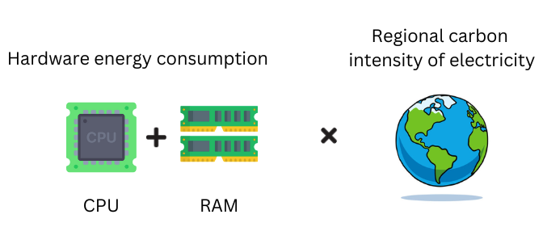

# Summary

Node.js is a popular JavaScript runtime environment that is widely used for web development and server-side applications. However, the environmental impact of Node.js processes is often overlooked. Node-carbon is a tool that can be used to measure the carbon footprint of Node.js processes. It does this by estimating the electricity consumption of the hardware used to run the processes and then applying the carbon intensity of the region where the processes are running.

# Statement of need

The increasing popularity of Node.js [@w3techs_usage_2022] for web development and server-side applications has raised concerns about the environmental impact of computational processes [@szczesny_reduce_2021]. While existing tools like [CO2.js](https://developers.thegreenwebfoundation.org/co2js/overview/), [EcoPing](https://ecoping.earth), and [Website Carbon Calculator](https://www.websitecarbon.com/) provide valuable insights into the carbon footprint of web applications, they primarily focus on factors like grid energy mix, process execution time, system boundaries [@greenwood_why_2020] and data transfer, lacking a comprehensive approach that incorporates hardware power usage. This limitation can lead to inaccurate carbon footprint assessments and hinder developers' efforts to minimize their environmental impact.

To address this gap, there is a need for a more comprehensive tool like Node Carbon that directly measures hardware power consumption (RAM + CPU) and incorporates it into its carbon footprint calculations. This enhanced approach would provide developers with more accurate and actionable insights, enabling them to:

- Optimize their code to reduce energy consumption
- Select more efficient hardware components
- Choose hosting providers that utilize renewable energy sources

By accurately quantifying the carbon footprint of Node.js applications, Node Carbon empowers developers to make informed decisions that contribute to a more sustainable digital ecosystem.

# Related software

There are several libraries available for developers to assess the carbon emissions of their web applications. Among them, [Website Carbon](https://www.websitecarbon.com/), [CO2.js](https://www.thegreenwebfoundation.org/) and [EcoPing](https://ecoping.earth/) and are noteworthy. Website Carbon measures website energy consumption by analyzing data transfer and usage patterns, repeat visitors, and energy sources[@website_carbon_2019]. It uses [The Green Web Foundation (TGWF)](https://www.thegreenwebfoundation.org/) database to check if data centers use green energy and estimates carbon emissions using grid and renewable energy factors. Whereas Ecoping calculates website carbon emissions using live grid data from around the world to reflect energy consumption of data centers and websites, along with green hosting practices based on the location of website resources and energy production [@ecoping_measure_2020].
 
On the other hand, CO2.js, an open-source JavaScript library, estimates carbon emissions through models like SWD [@swd_2022] and OneByte [@one_byte_2022]. It takes into account variables such as data size, type, and network efficiency. Here, Grid intensity data is obtained from sources such as [Ember](https://ember-climate.org/) and [UNFCCC](https://unfccc.int/). The data reflects the amount of carbon dioxide emissions per unit of electricity generated in a specific location. One can use open-source tools like [Scaphandre](https://github.com/hubblo-org/scaphandre), [Greenframe CLI](https://github.com/marmelab/greenframe-cli), and [DIMPACT](https://dimpact.org) to calculate customized carbon emissions. For cloud-based workloads, [Cloud Carbon Footprint](https://www.cloudcarbonfootprint.org/) can also be used.

Similarly to these, Node Carbon estimates the amount of carbon dioxide (CO2) produced by personal computing resources used to execute the code. It estimates the electricity consumption of the hardware used to run the processes and applies the carbon intensity of the region where the processes are being executed. This helps in measuring the environmental impact of running code on personal computing devices.

# Overview

Node Carbon calculates CO₂ emissions using Carbon Intensity (C) and Energy Consumed (E). C is the CO₂ emitted per kilowatt-hour of electricity consumed while E is the amount of electricity consumed by the computational infrastructure. \autoref{fig:carbon_emission} describes the general process of calculating carbon emission.

{width="100%"}

Carbon Intensity of electricity is based on emissions from energy sources used to generate it [@carbonbetter_carbon_2023]. Fossil fuels have high carbon intensities, while low-carbon fuels include solar, hydro, biomass, and geothermal power [@iea_global_energy_2020]. Node carbon calculates the carbon intensity of consumed electricity based on the mix of sources used. Providers like [Electricity Maps](https://www.electricitymaps.com/) and [WattTime](https://www.watttime.org/) can be used for real-time grid intensity data. Here, we rely on carbon intensity electricity data from [Our World in Data](https://ourworldindata.org/grapher/carbon-intensity-electricity) and process it. If data is missing, we use [code carbon data](https://mlco2.github.io/codecarbon/methodology.html#id5).

The power supply to the underlying hardware is tracked based on computational usage. To ensure security and stability, the power usage of RAM used here is 3 watts for an 8 GB ratio [@ram_power_usage_2019]. We measure CPU usage by correlating current usage with TDPs from the data source, then multiplying by the CPU usage.

# References